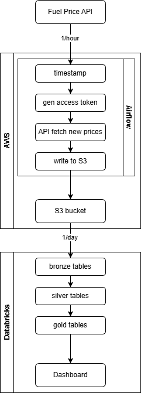
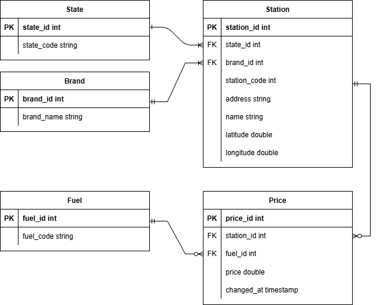
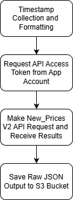
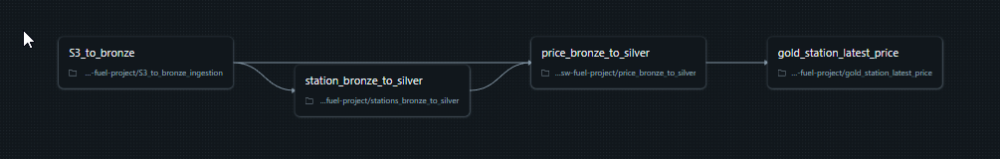
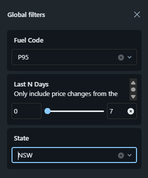
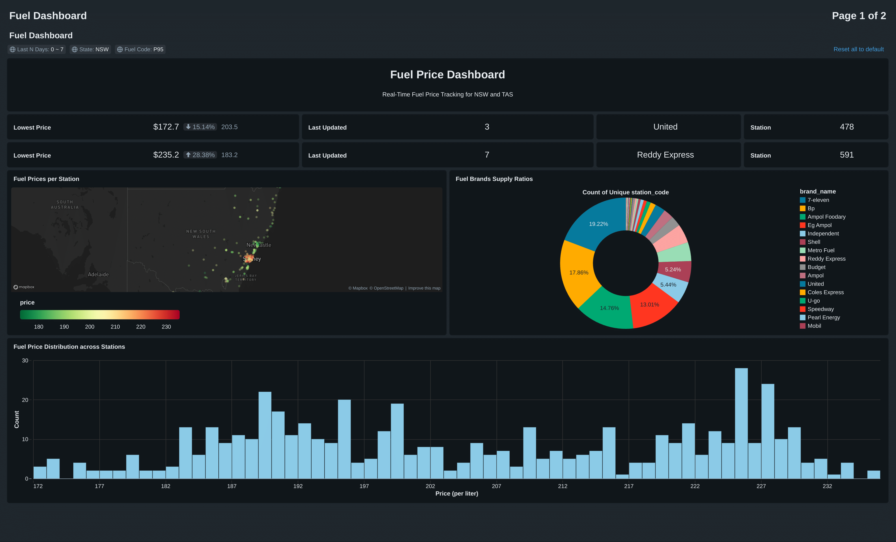
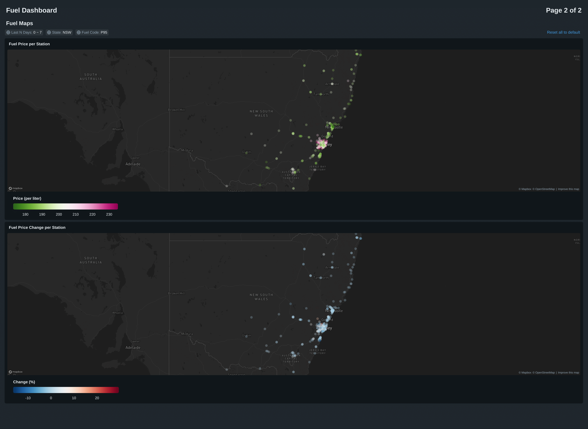

# Fuel Price Lakehouse Data Pipeline


## Overview

This project is to explore and demonstrate a **full end-to-end real-time data engineering pipeline** from real-world data sources. It pulls the data from an API, store and processes it, and then visualises it on a dashboard.

Areas of Focus:
- Data Orchestration with Apache Airflow
- Cloud Storage and Compute using AWS S3 and AWS EC2
- Data processing with Databricks and PySpark
- Medallion Architecture
- SQL fundamentals

## Architecture

**Architecture Diagram**:



The pipeline is designed to leverage industry standard tools (Airflow, AWS, Databricks) on a minimal budget using best practices where possible.

Fuel API:
- Source: https://api.nsw.gov.au/Product/Index/22
- I used the V2 endpoints (NSW + TAS)
- I call the All_Prices endpoint once initially to get station baseline prices.
- I call the New_Prices endpoint 1/hour, to stay within the free tier of 2500/month.

Data Flow:
1. Airflow DAG scheduled every hour from t3.medium EC2 instance:
    a. gets access token
    b. fetches new_prices json from API
    c. saves raw json to S3
2. Databricks job scheduled every day:
    a. loads only new data (auto-loader) from S3 to **station** and **price** bronze tables in Databricks
    b. processes and cleans the bronze data into silver tables: **state**, **brand**, **station**, **fuel**, and **price**
    c. aggregates the silver data into a gold table: **station_latest_prices**
3. Databricks dashboard visualises the gold table data

**Silver Tables ERD**:




## Airflow DAG

**Airflow hourly DAG**:



The Airflow DAG is defined in `airflow_dags/fuel_price_dag.py`. It consists of the following tasks:
- get and format a timestmap to name the json file
- get an access token from the Fuel API
- fetch new prices json data from the Fuel API
- save the raw json data to S3

## Databricks Job

**Databricks Job Tasks Workflow**:



The S3_to_bronze notebook:
1. uses an autoloader pattern to only read new JSON files from S3
2. Splits and saves the data into two bronze tables: station and price (without doing any other processing)

The station_bronze_to_silver notebook:
1. processes the Bronze station table into the silver tables: state, brand, and station.
2. normalising the names, removing duplicates, and upgading them to 3NF.
3. also make sure to convert the location column into latitude and longitude columns.
4. again, we use checkpoints to make sure we only process new data.

The price_bronze_to_silver notebook:
1. processes the Bronze price table into the silver tables: fuel and price.
2. again normalising the names, removing duplicates, and upgading them to 3NF.
3. make sure to filter out price = 0 and prices > 995.
4. again, we use checkpoints to make sure we only process new data.

The gold_station_latest_price notebook:
1. aggregates the silver tables into a gold table: station_latest_prices.
2. designed to show the latest prices for each fuel_type in each station, as well as the previous price at that station. See the SQL below.
3. we again checkpoint for incremental processing.

```sql
with cte as (
    select 
        station_id, fuel_id, price, changed_at,
        row_number() over (partition by station_id, fuel_id order by changed_at desc) as rn,
        lead(price, 1) over (partition by station_id, fuel_id order by changed_at desc) as prev_price,
        lead(changed_at, 1) over (partition by station_id, fuel_id order by changed_at desc) as prev_changed_at,
        ((price / prev_price) - 1) * 100.0 as pct_change,
        extract(day from changed_at - prev_changed_at) as days_between_change,
        extract(day from now() - changed_at) as days_since_latest_change
    from {silver_price_table}
)
select 
    s.station_code,
    b.brand_name,
    st.state_code,
    f.fuel_code,
    cte.price,
    cte.prev_price,
    cte.pct_change,
    cte.days_between_change,
    cte.days_since_latest_change,
    s.longitude,
    s.latitude
from 
    (cte left join
    (({silver_station_table} s left join {silver_brand_table} b on s.brand_id = b.brand_id)
    left join {silver_state_table} st on s.state_id = st.state_id)
    on cte.station_id = s.station_id) 
    left join {silver_fuel_table} f on cte.fuel_id = f.fuel_id
where rn = 1
```

## Databricks Dashboard

**Databricks Dashboard**:





Global Filters:
- All dashboard plots are hooked into the global filters seen above. 
- dashboard users can filter by State (NSW or TAS), by Fuel (P95, P98, U91, etc), and window cutoff to consider prices
- This is done using Databricks dashboard widgets.
- we leverage the latitude and longitude to plot the stations the state map, giving users a geographical context of the prices.
